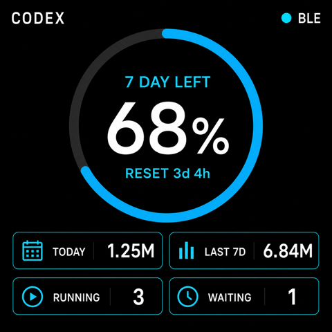
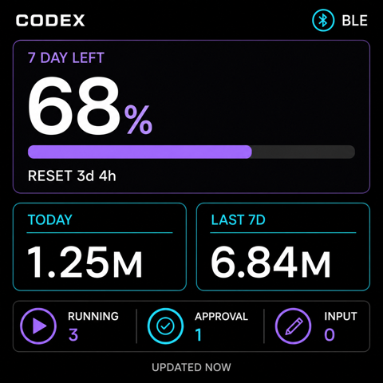
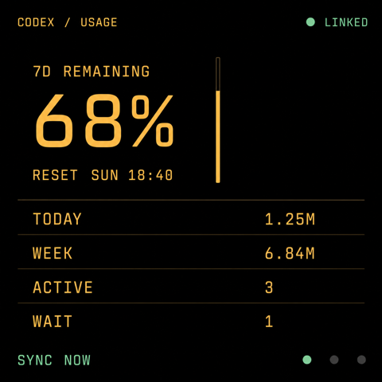
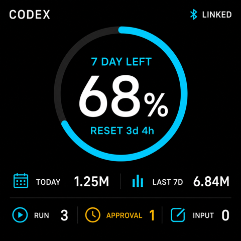
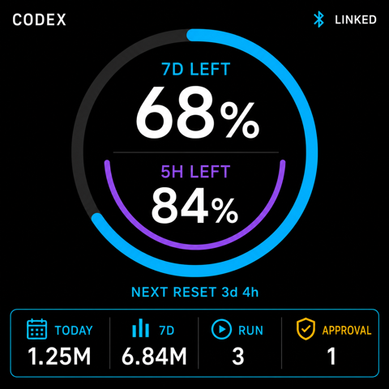

# Codex Usage Display 产品方案

## 1. 文档状态

- 状态：初步方案
- 目标硬件：Waveshare ESP32-S3-Touch-AMOLED-2.16
- 固件框架：Arduino
- 主机端：Desktop Companion，首版优先考虑 macOS
- 通信方式：Bluetooth Low Energy（BLE）

## 2. 产品目标

设备通过 BLE 与电脑端 Companion 连接，展示 Codex 的用量和任务状态，并通过触摸屏或实体按键向电脑发送受控操作。

首版计划展示：

- Codex 限额窗口剩余百分比
- 限额窗口下次重置时间
- 今日 token 用量
- 最近 7 天 token 用量
- 可用 reset credit 数量
- 最近一个 reset credit 的过期时间
- 正在运行的对话数量
- BLE、Companion 和数据同步状态

首版计划支持：

- 手动刷新数据
- 查看当前 Codex 限额窗口
- 开关隐私模式
- 聚焦电脑上的 Codex
- 打开当前正在运行的任务

## 3. 核心假设

- 用户通过 ChatGPT 账号登录 Codex，而不是只使用 OpenAI API Key。
- ESP32 不直接访问 OpenAI，不保存 ChatGPT Cookie、Codex Token 或 OpenAI API Key。
- Codex 数据采集和电脑操作均由 Companion 完成。
- ESP32 只负责显示、BLE 通信、设备设置和用户交互。
- 第一版优先支持一台设备绑定一台电脑。

## 4. 总体架构

```text
Codex app-server
        ↕ JSON-RPC
Desktop Companion
        ↕ BLE GATT
ESP32-S3 AMOLED
```

职责划分：

### Codex app-server

- 提供账户用量和限额
- 提供 thread 列表和实时状态
- 提供 Codex 操作能力

### Desktop Companion

- 连接 Codex app-server
- 汇总今日和最近 7 天 token
- 计算限额剩余百分比和倒计时
- 维护 BLE 连接
- 向设备推送状态
- 验证并执行设备发来的动作
- 记录动作结果和安全日志

### ESP32 固件

- AMOLED 和 LVGL UI
- 触摸和实体键交互
- BLE GATT Server
- 状态缓存和断线提示
- 电源和屏幕休眠管理

## 5. Codex 数据源

当前 Codex app-server 协议提供以下相关接口：

| 接口或事件 | 用途 |
|---|---|
| `account/rateLimits/read` | 获取限额窗口、重置时间和 reset credit |
| `account/usage/read` | 获取 UTC 每日 token bucket 和累计统计 |
| `account/rateLimits/updated` | 接收限额变化通知 |
| `thread/list` | 获取 thread 和运行状态 |
| `thread/loaded/list` | 获取当前 app-server 加载的 thread |
| `thread/status/changed` | 接收 thread 状态变化 |
| `account/rateLimitResetCredit/consume` | 消耗 reset credit，首版不向设备开放 |

限额窗口包含：

```text
usedPercent
windowDurationMins
resetsAt
```

电脑端计算：

```text
remainingPercent = 100 - usedPercent
```

Codex 当前不再提供 5 小时窗口。固件仍不写死窗口名称，而是根据服务端返回的 `windowDurationMins` 生成标签，避免未来窗口规则变化时必须升级固件。

`account/usage/read` 返回 UTC 每日 token bucket。电脑端根据 UTC 日期汇总：

```text
tokensToday = 当前 UTC 日期 bucket
tokens7d = 最近 7 个 UTC 日期 bucket 之和
```

## 6. 主要技术风险

验证结果：独立 Companion app-server 的 `thread/loaded/list` 看不到 Codex
Desktop 进程已经加载的 thread，`thread/list` 中对应状态为 `notLoaded`。

当前实现使用全局 Codex Hook 和 rollout 校准：

- `UserPromptSubmit` 提供即时开始提示，先建立 `pending_start`；
- `Stop` 只建立 `pending_stop`，不直接减少运行数；
- Companion 使用 Hook 提供的 `turn_id`，在对应 transcript 中精确匹配
  `task_started` 和 `task_complete`；
- 未确认的开始事件在 10 秒后撤销；
- 每 30 秒扫描最近 thread 作为漏 Hook、进程崩溃和旧记录的兜底；
- 最近 30 分钟没有继续写入的异常记录不会永久占用运行数。

该口径能覆盖 Codex Desktop、IDE 和 CLI 的跨进程任务，但 Hook 输入和本地
transcript 仍不是面向第三方长期稳定的数据接口，Codex 升级后可能需要适配。

## 7. BLE 方案

ESP32-S3 支持 Bluetooth 5 LE，不支持 Bluetooth Classic，因此采用 BLE GATT，不使用传统蓝牙 SPP。

角色分配：

- ESP32：BLE Peripheral + GATT Server
- Desktop Companion：BLE Central + GATT Client

建议使用一个自定义 Service：

| Characteristic | GATT 属性 | 用途 |
|---|---|---|
| `status` | Write（加密） | Companion 向设备推送状态 |
| `command` | Read、Notify（加密） | 设备向 Companion 发送动作 |
| `result` | Write（加密） | Companion 返回动作结果 |
| `device_info` | Read | 协议版本、固件版本和电量 |

第一版使用不超过 180 字节的紧凑 JSON，使状态快照能放入 macOS 常见的 185-byte 协商 MTU。消息包含：

- 协议版本
- request ID
- 序列号
- 操作结果
- 生成时间和时区

当前状态包不分片；如果后续超过 180 字节，再引入分片编号和总分片数。数据模型稳定后再考虑 CBOR。

线上状态示例（键名为 BLE 紧凑格式）：

```json
{
  "v": 1,
  "s": 1024,
  "t": 1784341234,
  "o": 480,
  "r": 68,
  "u": 10080,
  "q": 201600,
  "d": 1250000,
  "w": 6840000,
  "c": 2,
  "x": 358400,
  "a": 3
}
```

其中 `r` 为剩余百分比、`u` 为窗口分钟数、`q` 和 `x` 为从快照生成时刻起的剩余秒数。

## 8. BLE 配对和连接交互

### 8.1 首次配对

```text
未绑定
  ↓
设备断线时广播 `Codex Display`
  ↓
Companion 根据 Service UUID 发现设备
  ↓
设备显示随机 6 位验证码
  ↓
用户在 Mac 系统配对框输入验证码
  ↓
保存 bond 和电脑身份
  ↓
发送完整状态快照
```

设备配对页面显示：

```text
验证码
382 614

ENTER ON YOUR MAC
```

GATT 的状态、命令和结果特征要求加密，配对使用 BLE Secure Connections、MITM passkey 和 bonding。设备名称只用于发现，不作为身份校验。

### 8.2 自动重连

绑定后，设备开机仅尝试连接已绑定电脑：

```text
开机
  ↓
向已绑定电脑广播
  ↓
Companion 自动连接
  ↓
订阅 Notify
  ↓
Companion 发送完整状态
  ↓
进入增量更新
```

建议显示以下连接状态：

- 正在寻找电脑
- 已连接，正在同步
- 已连接
- 连接已中断，正在重连
- Companion 未运行
- 数据已过期

BLE 已连接不等于应用层正常工作，因此需要心跳：

- 15 秒没有 heartbeat：显示黄色连接状态
- 60 秒没有状态：显示 `STALE`
- 恢复连接后：先发送完整 snapshot，再恢复增量更新

### 8.3 更换电脑

更换电脑必须手动解除现有绑定：

1. 停止旧电脑上的 Companion。
2. 在设备正常运行时长按 BOOT 3 秒。
3. 清除所有 bond 并自动重启。
4. 在新电脑启动 Companion。
5. 输入设备显示的新六位配对码。

该操作只在固件正常运行时识别。不要在开机或复位过程中按住
BOOT，否则会进入 ESP32-S3 下载模式。

## 9. 三个板载按键

开发板上的三个按键并不是三个完全等价的普通功能键：

| 按键 | 硬件连接 | 产品用途 |
|---|---|---|
| BOOT / Key2（正面左侧） | GPIO0 | 运行时短按亮屏/熄屏；上电时仍保留下载模式 |
| PWR / Key1（正面中间） | AXP2101 电源链路 | 长按 6 秒真正关闭主电源 |
| IO18 / Key3（正面右侧） | GPIO18，按下接地 | 唤起 Codex 和快捷操作 |

### 9.1 BOOT 的物理位置

官方板载资源图：


观察方向不同，左右会镜像：

- 看 PCB 元器件面，并让 USB-C 朝下：顶部三个按键从左到右为 `IO18`、`PWR`、`BOOT`。BOOT 是右上方、靠近 MIC2 和 MicroSD 卡槽的按键。
- 看组装后的设备正面，并让屏幕朝向用户、三个按键位于顶部：BOOT 对应顶部最左侧按键。

官方图中的编号：

- 10：IO18
- 11：PWR
- 12：BOOT

BOOT 连接 GPIO0。上电或复位时按住 BOOT 会进入下载模式，因此不应承担频繁使用或不可逆的产品操作。

### 9.2 推荐按键映射

#### PWR

- 短按不触发产品功能，避免误关机
- 长按 6 秒由 AXP2101 执行真正的主电源关闭
- 关机后需要再次按 PWR 开机

#### IO18

- 单击：让电脑聚焦 Codex；存在 active thread 时优先打开最近活跃的任务
- 长按 1 秒：打开快捷操作浮层
- 未绑定时长按 3 秒：进入配对模式
- 配对过程中单击：确认验证码
- 敏感操作中长按：物理确认

#### BOOT

- 正常运行时短按：亮屏/熄屏
- 正常运行时长按 3 秒：清除 BLE bond 并自动重启，用于更换电脑
- 上电或复位时按住：仍会进入 USB 下载模式
- 同时保留固件故障恢复和开发调试用途

## 10. UI 信息架构

### 10.1 屏幕设计基准

所有 UI 必须以实际屏幕为基准，而不是按手机或网页界面缩放：

| 属性 | 设计基准 |
|---|---|
| 面板 | 2.16 英寸 AMOLED |
| 逻辑分辨率 | 480 × 480 px |
| 宽高比 | 1:1 正方形 |
| 主背景 | 纯黑或接近纯黑 |
| 页面安全边距 | 16 到 20 px |
| 普通触摸目标 | 不小于 56 × 56 px |
| 字体 | LVGL Montserrat；原型使用接近的中性无衬线字体 |
| 字重 | 只使用 Regular 400 和 Medium 500，不使用全局 Bold 700 |
| 主百分比 | 100 px / Medium 500 |
| 主指标标签 | 18 px / Regular 400 |
| 顶栏日期时间 | 18 px / Regular 400 |
| 次级倒计时 | 13 px / Regular 400 |
| 底部数据 | 24 到 26 px / Medium 500 |
| 底部标签 | 12 px / Regular 400 |

设计约束：

- 不使用手机纵向信息流。
- 不依赖鼠标悬停状态。
- 用户应能在桌面距离快速读出剩余额度和运行任务数。
- 页面最多保留一个主要视觉焦点。
- 使用大数字、短标签和明确的连接状态。
- 动态数字使用等宽数字，避免刷新时左右跳动。
- 不用普遍加粗表达层级；优先使用字号、颜色和留白。
- 避免大面积常亮白色，降低 AMOLED 烧屏风险。
- 所有评审稿最终都应缩放到 480 × 480 后检查，不以高清源图观感代替真机可读性。

### 10.2 主页面视觉方向

以下三张图均已处理为设备真实逻辑分辨率 480 × 480。

#### 方案 A：环形额度仪表盘



特点：

- 剩余额度是唯一视觉中心。
- 最适合远距离快速查看。
- 下方四个数据格能容纳最关键的辅助信息。
- 环形高亮面积较大，需要定时熄屏和轻微位置偏移。

#### 方案 B：数据卡片仪表盘



特点：

- 信息层级最完整。
- 运行、等待批准和等待输入可以同时呈现。
- 使用 LVGL 的矩形、Label 和 Bar 即可实现。
- 信息密度最高，小尺寸真机上需要严格控制字体。

#### 方案 C：极简状态面板



特点：

- 纯黑像素最多，适合 AMOLED 长时间显示。
- 结构简单，固件实现和刷新成本最低。
- 技术仪表风格明显。
- 图形反馈较弱，更依赖文字和数字。

当前建议以方案 A 为默认方向，保留方案 C 作为低亮度或常显模式。`APPROVAL` 和 `INPUT` 不纳入首版首页：启用 bypass permissions 后批准等待基本没有价值，而等待输入缺少稳定、可验证的统一口径。

#### 方案 A 的进一步探索

以下三张图继续保留“剩余额度是唯一视觉中心”的原则，并均按 480 × 480 输出和检查。

##### A1：精炼单环



- 保留原方案的单环认知模型，减少底部卡片边框和常亮面积。
- 曾尝试把 `RUN`、`APPROVAL`、`INPUT` 同时放入首页，但后两项不纳入 MVP。
- 信息仍然偏多，更适合正常亮屏模式。

##### A2：双窗口环



- 这是基于旧版 5 小时与 7 天双窗口规则制作的探索稿。
- Codex 当前已没有 5 小时窗口，因此该方案废弃，不进入实现。

##### A3：开口弧仪表


- 开口自然容纳重置倒计时，主数字周围留白更充足。
- 270° 总轨道中，青色弧严格表示 68% 剩余额度，暗灰弧表示其余 32%，避免看起来像 100%。
- 底部使用单条信息带，真机缩小后仍有清晰层级。
- 仪表与底部信息带之间使用离散短线表示 reset credit 数量，一段代表一个 credit。
- reset credit 默认使用青色；仅当最近过期时间小于等于 48 小时时，对应色段和底部倒计时改为琥珀色。
- 底部第四格专门显示最近过期倒计时。
- 亮像素更少，视觉更安静，适合作为默认首页方向。

进一步探索后的建议是以 A3 作为第一版默认首页。A1 只保留为历史视觉探索，A2 因 5 小时窗口取消而废弃。

### 10.3 主页面信息结构

```text
┌────────────────────────────┐
│ 14:32                  ●BLE│
│                            │
│       7 DAY LEFT           │
│           68%              │
│ QUOTA RESET 2d 8h          │
│ RESET      ━  ━  ━         │
│                            │
│ TODAY          1.25M       │
│ LAST 7D        6.84M       │
│                            │
│ RUNNING  3   NEXT EXP 3d4h │
└────────────────────────────┘
```

首页中的两个 reset 概念必须明确区分：

- `QUOTA RESET`：当前限额窗口恢复的时间。
- `RESET` 色段：当前尚未过期、可以使用的 reset credit 数量，一段代表一个。
- 有效 reset credit 默认使用青色。
- 最近过期时间大于 48 小时时不使用警示色；小于等于 48 小时时，最近过期的色段和 `NEXT EXP` 改为琥珀色。
- `NEXT EXP`：最近一个 reset credit 的过期倒计时；数量为 0 时不显示色段，并显示 `NEXT EXP —`。
- 已过期的 credit 不计入数量；数据陈旧或 BLE 断连时色段统一显示灰色，避免把同步异常误解为过期警告。

首版预计 reset credit 数量较少，直接按数量绘制。若实际数量超过 6 个，则色段区域改为 `RESET ×N`，避免继续压缩色段导致无法辨认。

### 10.4 主屏交互与时间

第一屏左上角以单行短格式显示电脑本地日期和时间，替代重复的 `CODEX` 标题：

- Companion 在连接和日期、时区变化时发送当前 Unix 时间与 `utc_offset_min`。
- ESP32 在两次同步之间自行走时，每分钟刷新一次。
- 尚未获得可信时间时显示 `--:--`，不使用编译时间或猜测时区。
- MVP 固定使用 `MM/dd HH:mm`，例如 `07/18 14:32`；日期在前、时间在后。
- 使用 24 小时制，不显示年份、星期、秒和 AM/PM。
- 后续若支持其他地区，则根据 Companion 传入的 locale 使用 CLDR 短日期与短时间格式，不在固件中假设全球都使用月/日顺序。

第一版交互：

- 点击 `RUN`：让电脑聚焦最近活跃的 Codex 任务。
- 点击 BLE 状态：断线时立即发起重连；已连接时只显示连接信息浮层。
- 点击额度圆盘：暂不绑定操作。
- 下拉或点击空白区域不绑定操作，避免误触。

默认启用隐私模式，不展示 thread 名称、工作目录或 prompt。

`waiting approval` 和 `waiting input` 暂不作为产品指标：前者在 bypass permissions 模式下长期无意义，后者难以从现有状态稳定判断。后续只有在 Companion 能给出可测试、跨版本稳定的口径时才重新评估。

### 10.5 临时浮层

以下状态允许覆盖主界面，但不算独立页面：

- 首次配对和验证码确认。
- BLE 断线、重连和数据陈旧提示。
- IO18 长按呼出的快捷操作：`FOCUS CODEX`、`REFRESH`、`NEW TASK`、`CANCEL`。
- 操作成功、失败或超时提示；约 2 秒后自动消失。

浮层关闭后始终返回同一个主界面，不维护页面导航栈。

### 10.6 第二屏预留

LVGL 结构预留第二个页面容器和左右滑动手势，但 MVP 不创建可见的空白页面，也不显示分页指示器。内容确定后再启用第二屏，避免用户误滑到没有信息的界面。

第二屏的优先候选是任务控制页，例如 active task、`FOCUS`、`NEW TASK` 和 `REFRESH`；其次才是 7 日 token 图表。第一屏继续只承担快速查看，不因第二屏扩展而增加信息密度。

## 11. 电脑操作设计

设备只发送语义化 action，不发送任意 shell 命令。

请求示例：

```json
{
  "v": 1,
  "sid": 319028314,
  "id": 104,
  "a": "focus_codex"
}
```

返回示例：

```json
{
  "v": 1,
  "id": 104,
  "ok": 1,
  "m": "FOCUSED"
}
```

操作分级：

| 操作 | 交互 |
|---|---|
| 刷新 | 直接执行 |
| 聚焦 Codex、打开当前任务 | 直接执行 |
| 新建任务 | 从快捷操作浮层点击确认 |
| 中断任务、重试任务 | 长按 IO18 确认 |
| 批准权限、消耗 reset credit | MVP 不提供 |

首版不允许：

- 从设备发送任意 shell 命令
- 直接批准 Codex 权限请求
- 一键消耗 reset credit
- 从设备发送任意 prompt

## 12. 安全要求

当前已经实现：

- ESP32 不保存 OpenAI 或 Codex 凭据。
- 首次连接使用随机六位验证码、BLE Secure Connections、MITM 和 bonding。
- 状态、命令和结果 characteristic 要求加密访问。
- 每条动作带 session ID 和 request ID，Companion 对近期结果去重。
- Companion 只接受 `focus_codex`、`refresh`、`new_task` allowlist。
- 用户可在设备上长按 BOOT 清除全部 bond。
- Hook 不记录 prompt 或 assistant 回复。

尚未实现、公开发布时需要明确说明：

- 固件当前依赖 BLE stack 的 bond 校验，没有额外的单主机白名单。
- 广播和配对没有独立的 60 秒超时窗口。
- Companion 输出运行日志，但没有持久化安全审计日志。
- MVP 不向设备开放批准权限、任意 prompt、任意 shell 或消耗 reset credit。

## 13. AMOLED 和功耗

当前产品使用动态自动熄屏：

- BOOT 短按手动亮屏或熄屏
- 熄屏后可用触摸或 BOOT 唤醒
- 息屏后的首次触摸只唤醒屏幕，不触发界面控件
- `RUN` 从 0 变为非 0 时自动亮屏，60 秒后熄屏
- `RUN = 0` 时 15 秒无操作熄屏
- 周期 BLE 心跳只更新数据，不重置亮屏计时
- 定期轻微移动静态元素
- 避免长期显示高亮白色区域
- 断线时显示数据更新时间和 `STALE`

动态自动息屏用于降低 AMOLED 烧屏风险。后续仍可加入不影响可读性的像素级位置偏移。

更新策略：

- 限额和 token：30 到 60 秒同步一次
- thread 状态：事件触发
- 心跳：约 10 到 15 秒
- 完整状态校准：数分钟一次
- 断线重连：指数退避

## 14. MVP 范围

第一版只实现：

1. BLE 配对、绑定和自动重连。
2. Companion 和应用层心跳。
3. 限额剩余百分比和重置倒计时。
4. 今日和最近 7 天 token。
5. reset credit 数量和最近过期时间。
6. active thread 数量；不统计 waiting approval 和 waiting input。
7. 单屏触摸热区、临时浮层和手动刷新。
8. IO18 呼出菜单和物理确认。
9. 聚焦电脑上的 Codex。
10. AMOLED 自动/手动熄屏和陈旧数据提示。

第二版再考虑：

- 任务完成和等待处理提醒
- thread 列表
- 中断和重试任务
- 自定义预设动作
- Windows 支持
- BLE OTA

## 15. 建议的实施顺序

1. 验证 Codex app-server 数据和跨进程 thread 状态。
2. 编写 Desktop Companion 的数据适配层。
3. 用模拟数据验证 BLE GATT 和自动重连。
4. 完成 AMOLED、触摸和 IO18 基础交互。
5. 接入真实 Codex 状态。
6. 增加绑定、安全确认和断线恢复。
7. 完成功耗、烧屏和长时间稳定性测试。

## 16. 参考资料

- [Waveshare 产品文档](https://docs.waveshare.net/ESP32-S3-Touch-AMOLED-2.16)
- [Waveshare 资源与文档](https://docs.waveshare.net/ESP32-S3-Touch-AMOLED-2.16/Resources-And-Documents)
- [Waveshare Arduino 开发说明](https://docs.waveshare.net/ESP32-S3-Touch-AMOLED-2.16/Development-Environment-Setup-Arduino)
- [Waveshare 官方示例仓库](https://github.com/waveshareteam/ESP32-S3-Touch-AMOLED-2.16)
- [ESP32-S3 数据手册](https://documentation.espressif.com/esp32-s3_datasheet_en.pdf)
- [Codex App Server](https://learn.chatgpt.com/docs/app-server)
- [Codex CLI Commands](https://learn.chatgpt.com/docs/developer-commands?surface=cli)
