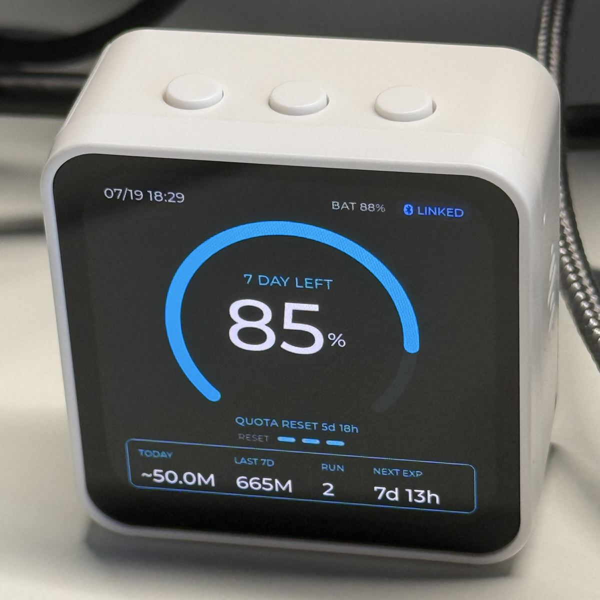

# Codex Usage Display

[简体中文](README.md) | [English](README.en.md)

Arduino firmware and a macOS companion for the Waveshare ESP32-S3-Touch-AMOLED-2.16. The device receives real Codex account usage and task status from the local computer over encrypted BLE. Codex credentials are never stored on the ESP32.

<p align="center">
  
</p>

> Current status: first usable hardware release. The firmware, BLE companion,
> global hooks, tests, and PlatformIO build are working end to end. Only the
> specified Waveshare board and macOS are currently supported.

## Contents

- [Features](#features)
- [Recommended: PlatformIO](#recommended-platformio)
- [Arduino IDE (alternative)](#arduino-ide-alternative)
- [Start the macOS Companion](#start-the-macos-companion)
- [Repository structure](#repository-structure)
- [Tests](#tests)
- [Data semantics and boundaries](#data-semantics-and-boundaries)
- [Current limitations](#current-limitations)
- [Contributing, security, and licenses](#contributing-security-and-licenses)

## Features

- CO5300 480 × 480 AMOLED over QSPI
- CST9217 touch controller
- AXP2101 power management
- LVGL 8.4 main screen and quick-actions overlay
- Date and time in `MM/dd HH:mm` format
- Remaining quota and quota-reset countdown
- Token usage for today and the last 7 days
- Number of running tasks
- Reset-credit segments and nearest-expiration countdown
- Amber warning when the nearest credit expires within 48 hours
- BLE Secure Connections pairing, automatic reconnection, and a 15-second heartbeat
- Real quota, token, and reset-credit data from the Codex app-server
- Real-time task start/stop detection through global Codex hooks, calibrated against local rollouts
- Device-to-Mac actions: `focus_codex`, `refresh`, and `new_task`
- `STALE` state after 60 seconds without a status update
- When `RUN > 0`, a newly started task wakes the screen and the screen turns off
  after 60 seconds. When `RUN = 0`, it turns off after 15 seconds of inactivity.
  BLE heartbeats update data without extending the screen timeout. Touch or BOOT
  wakes the screen; the first touch only wakes it and does not activate a control.

With the three physical buttons along the top edge when viewed from the front:

| Position | Button | Behavior |
|---|---|---|
| Left | BOOT / GPIO0 | Short press toggles the screen; hold for 3 seconds while running to clear BLE bonds and restart. Holding it during power-on still enters download mode. |
| Center | PWR / AXP2101 | Hold for 6 seconds to cut main power. |
| Right | IO18 | Short press sends `focus_codex`; hold for 1 second to open quick actions. |

`focus_codex` activates the ChatGPT/Codex app on the Mac. `refresh` immediately reloads the data. `new_task` uses macOS Accessibility to send `⌘N`.

## Recommended: PlatformIO

PlatformIO is the primary development path for this project. It pins the major
dependency versions used by the Waveshare Arduino example:

- Arduino-ESP32 3.3.5
- LVGL 8.4.0
- Arduino_GFX 1.6.4
- SensorLib 0.3.3
- XPowersLib 0.2.6

After installing PlatformIO:

```bash
pio run
```

The firmware image is written to:

```text
.pio/build/esp32-s3-touch-amoled-216/firmware.bin
```

With the board connected:

```bash
pio run -t upload
pio device monitor
```

If the download port is not detected, hold BOOT while connecting USB-C and release it when the port appears. Uploading replaces the firmware currently installed on the device.

## Arduino IDE (alternative)

Open [esp32/esp32.ino](esp32/esp32.ino) directly. Do not select only the containing folder in the file picker. Arduino IDE will also compile the implementation under `src/`.

Install **esp32 by Espressif Systems** from Boards Manager. Version 3.3.10 has been verified. `Arduino Nano ESP32` belongs to a different board package and is not appropriate for this Waveshare board.

Library versions verified with Arduino IDE:

- `ArduinoJson` 7.4.2
- `GFX Library for Arduino` 1.6.7
- `SensorLib` 0.4.1
- `XPowersLib` 0.3.3
- `lvgl` 8.4.0; do not install LVGL 9

Select:

- Board: `ESP32S3 Dev Module`
- Port: the `/dev/cu.usbmodem...` port for the device
- Flash Size: `16MB`
- PSRAM: `OPI PSRAM`
- USB CDC On Boot: `Enabled`
- Upload Mode: `UART0 / Hardware CDC`

Click Verify first, then Upload after the build succeeds. If the download port is not detected, hold BOOT while connecting USB-C and release it after the port appears.

## Start the macOS Companion

The companion requires macOS, Python 3.9 or newer, and a signed-in ChatGPT/Codex app. It starts the local `codex app-server` and reuses the existing login; no API key is required.

From the repository root:

```bash
./companion/run.sh
```

On first launch, the script creates an isolated environment under `companion/.venv` and installs `bleak`. Allow Terminal to use Bluetooth when macOS asks.

First secure pairing:

1. Flash the firmware and keep the device powered on. The header initially shows `OFFLINE`.
2. Start the companion. It discovers `Codex Display` and initiates secure pairing.
3. The device displays a random six-digit code such as `123 456`.
4. Enter the same code in the macOS pairing dialog.
5. The state changes to `LINKED` after the first real snapshot arrives.

To verify Codex data without connecting over BLE:

```bash
./companion/run.sh --once
```

The output is the same compact JSON payload that the firmware receives. By default, the companion sends a heartbeat every 15 seconds and reloads the full data every 60 seconds.

### Run in the background on macOS

First use `./companion/run.sh` to complete pairing and verify normal operation.
Stop the manually started companion, then install the user LaunchAgent:

```bash
python3 companion/install_launch_agent.py
```

The installer prepares `companion/.venv` and its dependencies before starting
the companion with that fixed Python environment. It starts automatically after
login and restarts only after an abnormal exit. Logs rotate at 1 MiB with one
archive retained:

```text
~/Library/Logs/CodexUsageDisplay/companion.log
~/Library/Logs/CodexUsageDisplay/companion.log.1
```

To stop and uninstall the background service:

```bash
python3 companion/install_launch_agent.py --uninstall
```

When no device is connected, the companion continues processing the hook file
once per second but pauses the 30-second `thread/list` reconciliation. Each BLE
scan lasts 10 seconds, with repeated failures backing off to at most 60 seconds
of sleep. After reconnecting, the companion performs a full Codex refresh before
sending its first packet. If the app-server exits unexpectedly, the companion
also exits so the LaunchAgent can restart both processes.

The Python process used by the LaunchAgent may require separate macOS Bluetooth
permission. `NEW TASK` still requires Accessibility permission. After the first
installation, test Bluetooth off/on, sleep/wake, and logging out and back in.

### Real-time RUN hooks

Run the installer to merge the RUN hooks into the existing global `~/.codex/hooks.json`:

```bash
python3 companion/install_hook.py
```

The installer is idempotent, avoids duplicate entries, and preserves unrelated hooks. When enabling local token estimation for the first time, you can manually initialize the current UTC day's existing data once:

```bash
/usr/bin/python3 .codex/hooks/codex_display_event.py --bootstrap
```

Initialization is intentionally not part of installation or startup. During normal operation, hooks only read the newly appended portion of the corresponding transcript. To uninstall:

```bash
python3 companion/install_hook.py --uninstall
```

The global hooks observe `UserPromptSubmit` and `Stop` for all Codex projects and invoke this repository's `.codex/hooks/codex_display_event.py` through the absolute path calculated at installation time. The hook does not use Bluetooth directly. It appends only `session_id`, `turn_id`, `transcript_path`, and the event type to:

```text
~/Library/Caches/CodexUsageDisplay/hook-events.jsonl
```

The companion consumes that queue as follows:

1. `UserPromptSubmit` creates a provisional running state and immediately pushes it over BLE.
2. The companion confirms it after finding `task_started` with the same `turn_id` in the corresponding transcript. If not confirmed within 10 seconds, the provisional state is removed.
3. `Stop` marks a task as pending stop without immediately decrementing RUN.
4. RUN is decremented only after `task_complete` with the same `turn_id` appears in the transcript, then immediately pushed over BLE.
5. While BLE is connected, recent tasks are additionally reconciled every 30 seconds to recover from missed hooks or process failures.

Hook writers and companion rotation share a cross-process file lock and use append-only writes, so concurrent Codex tasks do not overwrite one another. When the event file reaches 1 MiB, the companion rotates it to `hook-events.jsonl.1` and starts a fresh queue. One archive is retained, keeping the two files to approximately 2 MiB in total.

The `Stop` hook also accumulates newly observed local tokens in:

```text
~/Library/Caches/CodexUsageDisplay/local-usage.json
```

When the official daily bucket for the current day is absent, the device uses this value and prefixes `TODAY` with `~`. It automatically switches back to the account-level official value when the bucket appears. The state file uses the same cross-process lock and atomic replacement, so restarting the companion does not require rescanning every rollout.

The hook does not store prompts or assistant responses. It applies to all local Codex projects, while its source remains in this repository. If the repository is moved, rerun the installer to update the absolute path in `~/.codex/hooks.json`. Codex asks for review the first time a hook is found and whenever it changes; approve it in the hook-management interface, then start a new task or restart the current task for the configuration to take effect consistently.

If the companion reports that Bluetooth is off while the macOS menu bar shows it enabled, allow Terminal under **System Settings → Privacy & Security → Bluetooth**, then restart the companion.

The first use of `NEW TASK` also requires Terminal permission under **Privacy & Security → Accessibility**. If permission is denied, the action returns `ALLOW ACCESSIBILITY`; other features continue to work.

To move the display to another computer, stop the old companion first. While the device is running normally, hold the left BOOT button for 3 seconds. After `PAIRING CLEARED`, the device restarts. Run `./companion/run.sh` on the new computer and enter the new six-digit pairing code. Do not hold BOOT during power-on or reset, because that enters ESP32 download mode.

## Repository structure

```text
esp32/esp32.ino           Arduino IDE sketch entry point
lv_conf.h                 LVGL 8 configuration
src/board_config.h        Board pins and display parameters
src/app_state.h           Main-screen data model
src/ble_bridge.*          Encrypted BLE GATT, status parsing, and action transport
src/ui.h                  Public UI interface
src/main.cpp              Display, touch, power, buttons, and main loop
src/app_state.cpp         Time, token, and countdown formatting
src/ui.cpp                480 × 480 LVGL screen
src/fonts/                Custom main-percentage font
companion/codex_display/  macOS companion source
companion/tests/          Data-semantics and protocol tests
companion/run.sh          One-command companion launcher
companion/install_launch_agent.py macOS background-service installer
companion/install_hook.py Global hook installer and uninstaller
.codex/hooks/             Local event-forwarder invoked by the global hooks
docs/BLE_PROTOCOL.md      BLE UUIDs, message formats, and security constraints
PRODUCT_PLAN.md           Product, connection, and interaction design
```

See [docs/BLE_PROTOCOL.md](docs/BLE_PROTOCOL.md) for the wire protocol.

## Tests

```bash
python3 -m unittest discover -s companion/tests -v
./companion/run.sh --once
pio run
```

For Arduino IDE, use the same board and options listed above and click Verify. The current version has been built successfully with Arduino-ESP32 3.3.10 in Arduino IDE and Arduino-ESP32 3.3.5 through PlatformIO.

## Data semantics and boundaries

- Quota, window duration, reset time, and reset credits come from `account/rateLimits/read`.
- `TODAY` and `LAST 7D` come from UTC daily buckets returned by `account/usage/read`; the accounting day changes at 08:00 Singapore time.
- If the response contains no bucket at all for the current day, `TODAY` temporarily displays the `~estimated value` accumulated from local transcripts by the global hook. A present bucket whose value is zero is still treated as official. `LAST 7D` always uses server data.
- A standalone app-server cannot directly read active state from the Codex Desktop process's memory. Global hooks provide real-time hints for tasks across all projects, and rollout boundaries with the same `turn_id` confirm those hints. A 30-second reconciliation handles missed hooks. Stale records from abnormal termination are retained for at most 30 minutes.
- `focus_codex` currently focuses the Codex app but does not guarantee navigation to a specific thread.
- The device does not store prompts, thread names, working directories, ChatGPT cookies, or Codex tokens.

## Current limitations

- The companion currently supports only macOS and depends on a signed-in ChatGPT/Codex app.
- The Codex app-server and local transcripts are not long-term stable public third-party interfaces; Codex updates may require corresponding changes.
- Global hooks provide real-time hints, but RUN remains grounded in transcript boundaries and periodic reconciliation.
- The firmware has no OTA support and must be updated over USB.
- Only the Waveshare ESP32-S3-Touch-AMOLED-2.16 has been verified.

## Contributing, security, and licenses

- See [CONTRIBUTING.md](CONTRIBUTING.md) for the contribution workflow.
- Report security issues privately as described in [SECURITY.md](SECURITY.md).
- Project code is licensed under the [MIT License](LICENSE).
- The Montserrat font subset and build dependency notices are documented in [THIRD_PARTY_NOTICES.md](THIRD_PARTY_NOTICES.md).
