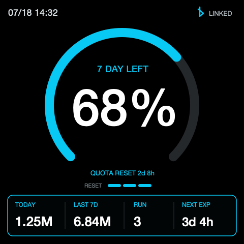

# Codex Usage Display

[简体中文](README.md) | [English](README.en.md)

Waveshare ESP32-S3-Touch-AMOLED-2.16 的 Arduino 固件和 macOS Companion。设备通过加密 BLE 接收本机 Codex 的真实账户用量和任务状态，不在 ESP32 中保存 Codex 凭据。



> 当前状态：首个可用硬件版本。固件、BLE Companion、全局 Hook、测试和
> PlatformIO 构建均已打通；目前只支持指定的 Waveshare 开发板和 macOS。

## 当前已实现

- CO5300 480 × 480 AMOLED（QSPI）
- CST9217 触摸
- AXP2101 电源管理
- LVGL 8.4 首页和快捷操作浮层
- `MM/dd HH:mm` 日期时间
- 剩余额度、额度重置倒计时
- 今日和最近 7 天 token
- 运行中的任务数
- reset credit 色段和最近过期倒计时
- 最近过期小于等于 48 小时时使用琥珀色提示
- BLE Secure Connections 配对、自动重连和 15 秒心跳
- 从 Codex app-server 读取真实额度、token 和 reset credit
- 通过全局 Codex Hook 实时感知任务开始/停止，并用本地 rollout 校准运行数
- 设备向 Mac 回传 `focus_codex`、`refresh` 和 `new_task`
- 60 秒无状态更新后显示 `STALE`
- `RUN > 0` 时任务开始自动亮屏并在 60 秒后熄屏；`RUN = 0`
  时 15 秒无操作熄屏。BLE 心跳更新数据但不延长亮屏，触摸或 BOOT
  可唤醒，首次触摸仅唤醒不触发控件

实体键按正面观察、三个按键位于顶部时定义：

| 位置 | 按键 | 行为 |
|---|---|---|
| 左 | BOOT / GPIO0 | 短按亮屏或熄屏；运行时长按 3 秒清除蓝牙绑定并重启；上电时按住仍进入下载模式 |
| 中 | PWR / AXP2101 | 长按 6 秒真正关闭主电源 |
| 右 | IO18 | 短按发送 `focus_codex`；长按 1 秒打开快捷操作 |

`focus_codex` 会激活 Mac 上的 ChatGPT/Codex App；`refresh` 立即重新读取数据；`new_task` 使用 macOS 辅助功能发送 `⌘N`。

## 使用 Arduino IDE

直接打开 [esp32/esp32.ino](esp32/esp32.ino)，不要在文件选择器里只选文件夹。Arduino IDE 会同时编译 `src/` 中的实际源码。

在 Boards Manager 中安装 **esp32 by Espressif Systems**。当前已验证 3.3.10 可以完整编译。`Arduino Nano ESP32` 属于另一套 board package，不适用于这块 Waveshare 板。

当前经过 Arduino IDE 构建验证的库版本：

- `ArduinoJson` 7.4.2
- `GFX Library for Arduino` 1.6.7
- `SensorLib` 0.4.1
- `XPowersLib` 0.3.3
- `lvgl` 8.4.0，不要安装 LVGL 9

然后选择：

- Board：`ESP32S3 Dev Module`
- Port：设备对应的 `/dev/cu.usbmodem...`
- Flash Size：`16MB`
- PSRAM：`OPI PSRAM`
- USB CDC On Boot：`Enabled`
- Upload Mode：`UART0 / Hardware CDC`

点击左上角 Verify 编译，确认通过后再点击 Upload。首次找不到下载端口时，按住 BOOT、连接 USB-C，识别到端口后松开 BOOT。

## 启动 macOS Companion

需要 macOS、Python 3.9 或更高版本，以及已经登录的 ChatGPT/Codex App。Companion 会启动本机 `codex app-server`，复用现有登录，不需要 API Key。

在终端进入本项目目录后执行：

```bash
./companion/run.sh
```

脚本首次运行会在 `companion/.venv` 创建隔离环境并安装 `bleak`。macOS 首次询问蓝牙权限时允许 Terminal。

首次安全配对：

1. 烧录固件并保持设备开机，顶部显示 `OFFLINE`。
2. 启动 Companion，它会发现 `Codex Display` 并发起安全配对。
3. 设备显示 `123 456` 形式的随机 6 位码。
4. 在 Mac 系统配对框中输入相同数字。
5. 收到首个真实快照后，状态变为 `LINKED`。

只验证 Codex 数据、不连接 BLE：

```bash
./companion/run.sh --once
```

输出是一条与固件实际接收内容相同的紧凑 JSON。Companion 默认每 15 秒发送心跳，每 60 秒重新读取完整数据。

### macOS 后台常驻

先使用 `./companion/run.sh` 完成首次配对并确认运行正常，然后停止手动启动的
Companion，安装用户级 LaunchAgent：

```bash
python3 companion/install_launch_agent.py
```

安装器会提前创建 `companion/.venv` 并安装依赖，再使用固定的 Python 环境启动
Companion。它会在登录后自动运行，并只在异常退出时重新启动。日志达到 1 MiB
后轮转并保留一份历史，位于：

```text
~/Library/Logs/CodexUsageDisplay/companion.log
~/Library/Logs/CodexUsageDisplay/companion.log.1
```

卸载并停止后台服务：

```bash
python3 companion/install_launch_agent.py --uninstall
```

未连接设备时，Companion 仍以 1 秒间隔处理 Hook 文件，但暂停每 30 秒的
`thread/list` 校准。BLE 每次扫描 10 秒，连续失败时逐步退避到最多休眠 60 秒。
重新连接后会先完整刷新 Codex 数据，再发送第一包。app-server 异常退出时，
Companion 会一并退出并由 LaunchAgent 重新启动。

LaunchAgent 使用的 Python 进程可能需要单独获得 macOS 蓝牙权限；`NEW TASK`
仍需要辅助功能权限。首次安装后请实测蓝牙关闭/开启、睡眠/唤醒和重新登录。

### 实时 RUN Hook

执行安装器，将 RUN Hook 合并进现有的全局 `~/.codex/hooks.json`：

```bash
python3 companion/install_hook.py
```

安装器可重复执行，不会重复添加，也会保留已有的其他 Hook。首次启用本地 token
估算时，可手动初始化一次 UTC 当天已有的数据：

```bash
/usr/bin/python3 .codex/hooks/codex_display_event.py --bootstrap
```

初始化不是安装或启动流程的一部分；日常只在 Hook 触发时读取对应 transcript
的新增部分。卸载时执行：

```bash
python3 companion/install_hook.py --uninstall
```

全局 Hook 监听所有 Codex 项目的 `UserPromptSubmit` 和 `Stop`，并通过安装时
计算出的绝对路径调用本仓库的 `.codex/hooks/codex_display_event.py`。Hook
不直接操作蓝牙，只把
`session_id`、`turn_id`、`transcript_path` 和事件类型追加到：

```text
~/Library/Caches/CodexUsageDisplay/hook-events.jsonl
```

Companion 从该队列接收提示：

1. `UserPromptSubmit` 先建立临时运行状态并立即推送 BLE。
2. Companion 在对应 transcript 中找到同一 `turn_id` 的 `task_started`
   后确认运行；10 秒内没有确认则撤销临时状态。
3. `Stop` 只标记为待停止，不直接减少 RUN。
4. 对应 transcript 出现同一 `turn_id` 的 `task_complete` 后才减少 RUN，
   并立即推送 BLE。
5. BLE 已连接时，每 30 秒额外读取一次最近任务进行校准，修复漏 Hook 或进程异常。

Hook 写入和 Companion 轮转共享一个跨进程文件锁，并使用追加写入，多个 Codex
任务同时触发也不会互相覆盖。事件文件达到 1 MiB 后，Companion 会将它轮转为
`hook-events.jsonl.1` 并创建新队列；只保留一份历史，两个文件合计最多约
2 MiB。

`Stop` Hook 同时将本机新增 token 累计到：

```text
~/Library/Caches/CodexUsageDisplay/local-usage.json
```

官方当天 daily bucket 尚未出现时，设备使用该值并在 `TODAY` 前显示 `~`；
官方桶出现后自动切回账户级官方值。状态文件使用同一个跨进程锁和原子替换，
Companion 重启不需要重新扫描全部 rollout。

Hook 不保存 prompt 或 assistant 回复。它对本机所有 Codex 项目生效，但脚本
源码仍保存在本仓库，移动仓库后需要同步修改 `~/.codex/hooks.json` 中的绝对
路径；重新运行安装器即可自动更新。Codex 首次发现或每次修改 Hook 后会要求审核；在 Hook 管理界面确认
信任，然后新开一个任务或重启当前任务使配置稳定生效。

如果提示蓝牙关闭，但 macOS 菜单栏显示蓝牙已开启，请到“系统设置 → 隐私与安全性 → 蓝牙”允许 Terminal，然后重新运行。

`NEW TASK` 第一次使用时还需要在“隐私与安全性 → 辅助功能”允许 Terminal；如果不授予，该动作会返回 `ALLOW ACCESSIBILITY`，其他功能不受影响。

更换电脑时，先停止旧电脑上的 Companion，再在设备正常运行时长按左侧 BOOT 3 秒。看到 `PAIRING CLEARED` 后设备会自动重启；随后在新电脑运行 `./companion/run.sh`，输入设备显示的新六位配对码。不要在开机或复位过程中按住 BOOT，否则会进入 ESP32 下载模式。

## 使用 PlatformIO

项目使用 PlatformIO，并固定到与 Waveshare Arduino 示例相同的主要依赖版本：

- Arduino-ESP32 3.3.5
- LVGL 8.4.0
- Arduino_GFX 1.6.4
- SensorLib 0.3.3
- XPowersLib 0.2.6

安装 PlatformIO 后执行：

```bash
pio run
```

固件输出：

```text
.pio/build/esp32-s3-touch-amoled-216/firmware.bin
```

连接开发板后烧录并查看串口：

```bash
pio run -t upload
pio device monitor
```

如果首次烧录时没有识别到下载端口，按住 BOOT、连接 USB-C，看到端口后松开 BOOT。烧录会替换设备中现有固件。

## 代码结构

```text
esp32/esp32.ino          Arduino IDE 工程入口
lv_conf.h                LVGL 8 配置
src/board_config.h       板级引脚和显示参数
src/app_state.h          首页数据模型
src/ble_bridge.*         加密 BLE GATT、状态解析和动作回传
src/ui.h                 UI 对外接口
src/main.cpp             显示、触摸、电源、按键和主循环
src/app_state.cpp        时间、token 和倒计时格式化
src/ui.cpp               480 × 480 LVGL 页面
src/fonts/               主百分比定制字体
companion/codex_display/ macOS Companion 源码
companion/tests/         数据口径和协议测试
companion/run.sh         Companion 一键启动脚本
companion/install_launch_agent.py macOS 后台常驻安装与卸载
companion/install_hook.py 全局 Hook 安装与卸载
.codex/hooks/            全局 Hook 调用的本地事件转发脚本
docs/BLE_PROTOCOL.md     BLE UUID、消息格式和安全约束
PRODUCT_PLAN.md          产品、连接和交互方案
```

详细线协议见 [docs/BLE_PROTOCOL.md](docs/BLE_PROTOCOL.md)。

## 测试

```bash
python3 -m unittest discover -s companion/tests -v
./companion/run.sh --once
pio run
```

Arduino IDE 使用上文相同的板型和参数点击 Verify。当前版本已在 Arduino-ESP32 3.3.10 和 PlatformIO/Arduino-ESP32 3.3.5 两套环境编译通过。

## 数据口径与边界

- 额度、窗口时长、重置时间和 reset credit 来自 `account/rateLimits/read`。
- `TODAY` 和 `LAST 7D` 来自 `account/usage/read` 的 UTC daily buckets；
  每天在新加坡时间 08:00 切换到新的统计日。
- 如果响应中完全缺少当天 bucket，`TODAY` 临时显示全局 Hook 从本机
  transcript 累计的 `~估算值`；当天 bucket 存在且值为 0 时仍视为官方值。
  `LAST 7D` 始终只使用服务器数据。
- 独立 app-server 无法直接读取 Codex Desktop 进程内存中的 active 状态。所有项目的任务由全局 Hook 提供实时提示，再使用同一 `turn_id` 的 rollout 边界确认；漏 Hook 情况由 30 秒定期扫描校准。异常中断的旧记录最多保留 30 分钟。
- `focus_codex` 目前聚焦 Codex App，不保证直接跳转到特定 thread。
- 设备不保存 prompt、thread 名称、工作目录、ChatGPT Cookie 或 Codex Token。

## 当前限制

- Companion 目前仅支持 macOS，并依赖本机已经登录的 ChatGPT/Codex App。
- Codex app-server 和本地 transcript 并不是面向第三方长期稳定的公共数据
  接口；Codex 升级后可能需要同步适配。
- 全局 Hook 提供实时提示，但 RUN 仍以 transcript 边界和定期扫描校准为准。
- 固件没有 OTA；升级需要通过 USB 重新烧录。
- 目前只验证了 Waveshare ESP32-S3-Touch-AMOLED-2.16。

## 贡献、安全与许可证

- 贡献流程见 [CONTRIBUTING.md](CONTRIBUTING.md)。
- 安全问题请按 [SECURITY.md](SECURITY.md) 私下报告。
- 项目代码使用 [MIT License](LICENSE)。
- Montserrat 字体子集及构建依赖声明见
  [THIRD_PARTY_NOTICES.md](THIRD_PARTY_NOTICES.md)。
